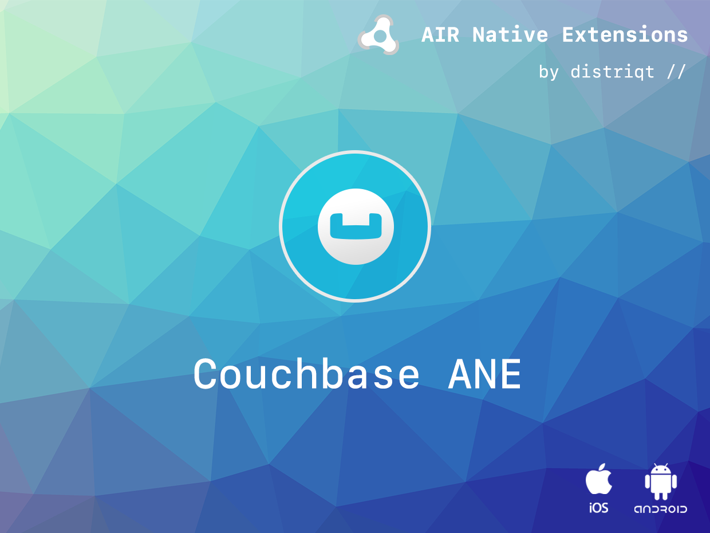

built by [distriqt //](https://airnativeextensions.com) 

# Couchbase

More information on Couchbase can be found here:

http://developer.couchbase.com/mobile/develop/training/build-first-ios-app/index.html

This extension uses a custom built version of the iOS community version as 
it was required to remove FTS from the sql usage. Seems that AIR has a version
of sqlite that gets used and doesn't support FTS. 

https://github.com/couchbase/couchbase-lite-ios
https://github.com/couchbase/couchbase-lite-ios/wiki/Building-Couchbase-Lite

## Documentation

Latest documentation can be found in the [wiki](https://github.com/distriqt/ANE-Couchbase/wiki)

More information here: 

[com.distriqt.Couchbase](https://airnativeextensions.com/extension/com.distriqt.Couchbase)

## License

You can purchase a license for using this extension:

[airnativeextensions.com](https://airnativeextensions.com/)

distriqt retains all copyright.

