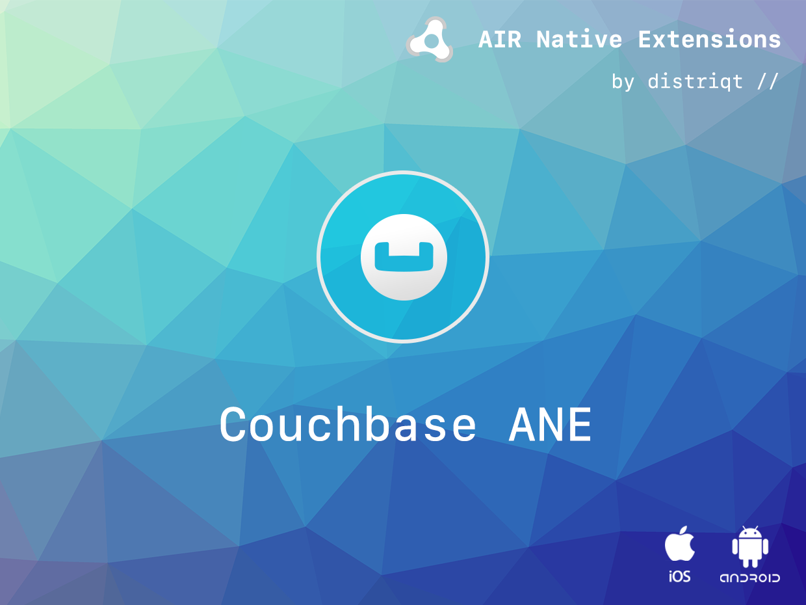
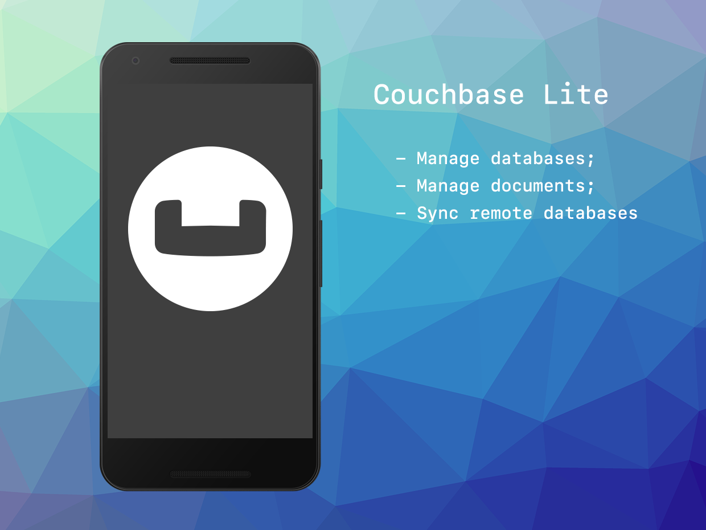

# Couchbase

The [Couchbase](https://airnativeextensions.com/extension/com.distriqt.Couchbase) extension gives 
you access to the Couchbase Lite SDK for using Couchbase databases on mobile devices.

### Features:

- Create and Retrieve Databases;
- Create, Retrieve and Delete documents;
- Synchronise with a remote database using the Couchbase Sync Gateway;

This Wiki forms the best source of detailed documentation for the extension along with 
the [asdocs](https://distriqt.github.io/ANE-Couchbase/asdocs). 

